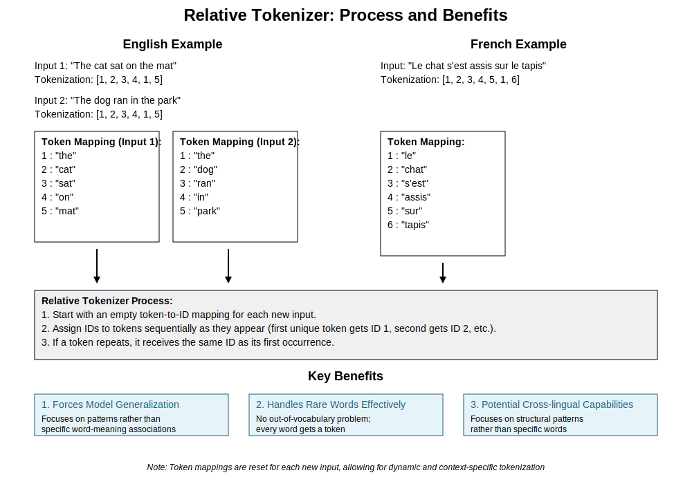

# Relative Tokenizer: A Novel Approach to Text Processing

## Table of Contents
1. [Introduction](#introduction)
2. [How It Works](#how-it-works)
3. [Potential Benefits](#potential-benefits)
4. [Example: Language Translation](#example-language-translation)
5. [Challenges and Architectural Considerations](#challenges-and-architectural-considerations)
6. [Conclusion](#conclusion)
7. [Example: Language Agnostic Translation](#language-agnostic-translation)

***Disclaimer, this is super expiremental! So I really have no idea how well it will work.***

## Introduction

A relative tokenizer is a text processing technique that assigns unique numerical identifiers to words or subword units within a given context, but resets this assignment for each new input sequence. I guess you can sorta think about it like a really bad text compression technique. But thats not the point. Unlike traditional tokenizers that maintain a fixed vocabulary across an entire dataset, relative tokenizers create a new, localized vocabulary for each input. While this may seem like a bad idea, and to be fair it might be, it does have some potentially usefull things about it.

## How It Works

1. For each input sequence (e.g., a sentence or paragraph):
   - Start with an empty token-to-ID mapping.
   - Assign IDs to tokens sequentially as they appear.
   - The first unique token gets ID 1, the second gets ID 2, and so on.
   - If a token repeats, it receives the same ID as its first occurrence.

2. Reset this mapping for the next input sequence.

For example:
- Input 1: "The cat sat on the mat"
  Tokenization: [1, 2, 3, 4, 1, 5]

- Input 2: "The dog ran in the park"
  Tokenization: [1, 2, 3, 4, 1, 5]

Note that "the" gets ID 1 in both cases, but "cat" and "dog" both get ID 2 in their respective sequences.

Note 2, you can also apply this like a "sliding window" where each possible window gets its own unique token mapping.

Note 3, you can also assign random unique numbers rather than going up sequentially. This could help avoid a model which simply increments the output upwards rather than learning real patterns.

## Potential Benefits

1. Forcing Generalization: By removing consistent global token identities, the model is forced to learn patterns and relationships rather than memorizing specific word-meaning associations. It is context specific, and models should only ever output tokens they have aready seen during inference.

2. Handling Rare Words: There's no out-of-vocabulary problem since every word gets a token, regardless of its frequency in the training data.

3. Cross-lingual Capabilities: It could potentially help in cross-lingual tasks by focusing on structural patterns rather than specific words. (more on that after the conclusion)

4. Reduced Preprocessing: No need to build and maintain a global vocabulary.

## Example: Language Translation (more on this later)

Consider a machine translation task:

1. Source sentence (English): "The cat sat on the mat"
   Relative tokenization: [1, 2, 3, 4, 1, 5]

2. Target sentence (French): "Le chat s'est assis sur le tapis"
   Relative tokenization: [1, 2, 3, 4, 5, 1, 6]

The model would learn to map the pattern [1, 2, 3, 4, 1, 5] to [1, 2, 3, 4, 5, 1, 6], focusing on the structural relationships rather than specific word translations. This could potentially help the model generalize better to unseen sentences and even assist in zero-shot translation to languages not seen during training. Note that IRL this would need lots more context and so that the patterns would be clearer to the model...

## Challenges and Architectural Considerations

While relative tokenization offers interesting possibilities, it also presents challenges for traditional neural network architectures:

1. Embedding Layer Problem: Standard embedding layers assume a fixed vocabulary and learn a unique vector for each token ID. With relative tokenization, the meaning of each ID changes for every input, making traditional embeddings ineffective.

2. Loss of Global Semantics: Without consistent token identities across the dataset, the model can't learn global semantic meanings of words.

3. Increased Reliance on Context: The model must rely heavily on contextual cues and structural patterns, which may require more sophisticated architectures.

To address these challenges, potential architectural approaches could include:

- Using positional encodings to provide consistent position information.
- Implementing relative attention mechanisms that focus on token relationships rather than identities.
- Designing architectures that can effectively capture and utilize local patterns and structural information.
- Incorporating multi-scale processing to balance local and global information.

## Conclusion

The optimal model architecture for leveraging relative tokenization remains an open question. It may involve novel components or combinations of existing techniques from areas such as graph neural networks, self-attention mechanisms, or recursive neural networks.

Relative tokenization presents an intriguing approach to text processing that forces models to focus on patterns and relationships rather than specific word identities. While it introduces challenges, it also opens up new possibilities for generalization and cross-lingual capabilities in natural language processing tasks.

# Language-Agnostic Translation

## Overview

This project implements a language-agnostic translation method that focuses on pattern matching rather than direct translation. The key components of this system are:

1. **GlobalRelativeTokenizer**: A `tokenizer` that assigns a unique numerical value to each unique word in the corpus, creating a language-agnostic representation of the text.
2. **GPT4MetaTranslator and ClaudeMetaTranslator**: LLMs that use the GlobalRelativeTokenizer target sequences into numerical tokens, allowing them to find patterns in the data and generate target sequences for new source inputs.
3. **SilverPath**: A module that analyzes the existing data and provides a metric for how confident the model should be in its translations, as well as a means of determining which materials might be highest priority for further curation.
4. **Translator**: A module that combines the components to perform automated translation, leveraging the linguistic anomaly detection to provide quality scores for the generated translations.

## Why this approach forces pattern matching

The key innovation of this approach is the use of the GlobalRelativeTokenizer, which converts the target texts into a language-agnostic numerical representation. This forces the translation models to focus on finding patterns in the data, rather than relying on direct word-to-word translations. It also allows for an easy way to spot hallucinations, only contextual numerical values should appear in the output. Supprisingly, when the model doesn't have good examples, it will hallucinate a new number, these can be replaced with an [unclear] marker. 

By representing the text as a sequence of numerical tokens, the models are forced to learn the underlying linguistic structures and mappings between the source and target sequences, rather than simply memorizing specific word-level translations, or relying on any outside biases. This allows the models to generalize better to new inputs, as they can apply the learned patterns to generate appropriate target sequences. Hypothetically this means that it is equally good at translating to almost any language, which also makes it easier to test.

## SilverPath vs GoldenPath
The `SilverPath` module further reinforces this pattern-matching approach by providing a metric for the model's confidence in its translations. Based on existing data, it is able to determine how easy it will be for a model to translate a given text. This helps the user understand which prompts are likely to be successfully translated based on the existing data, and where further curation may be needed to improve the model's performance. `GoldenPath` techniques are generally the opposite, they take a collection of prompts and tell people what samples they should get. `SilverPath` can be useful if there are existing translation samples, and you want to make the most of what you have so far -- even if they don't align with a specific `GoldenPath` for all desired prompts.

## How to use.

To use this method, you'll need to follow these steps:

1. Prepare your data: Ensure that you have three text files in the specified data directory: `source.txt`, `target.txt`, and `prompts.txt`. These files should contain the source sequences, target sequences, and prompts to be translated, respectively. They should be aligned by line.
2. Set up the API keys: Provide the necessary API keys for the translation services (OpenAI or Anthropic) in the `ClaudeMetaTranslator` and `GPT4MetaTranslator` classes.
3. (optional) Run the `SilverPath` module: This will analyze the existing data and generate a `ranked_prompts.jsonl` file, which provides a ranking of the prompts based on how well they can be translated using the current data.
4. Run the `Translator` module: This will perform the automated translation, using the `ClaudeMetaTranslator` and the linguistic anomaly detection to provide quality scores for the generated translations. The output will be written to an `output.txt` file in the data directory.

By following this process, you can leverage the language-agnostic pattern matching capabilities of the translation models to perform high-quality, automated translation, while also gaining insights into the strengths and weaknesses of your dataset.

## Linguistic Anomaly Detection (LAD)

The `lad.py` module introduces the `LinguisticAnomalyDetector` class, which is responsible for performing Linguistic Anomaly Detection on the translated texts. The key aspects of this class are:

1. **Initialization**: The class takes two lists as input, `source_reference` and `target_reference`, which represent the reference texts for the source and target languages, respectively.
2. **Ranking Similarity**: The `_rank_similar` method ranks the given references by their similarity to a query text using the `SequenceMatcher` from the `difflib` module.
3. **Anomaly Detection**: The `detect` method compares the ranking of the target draft against the target references and the ranking of the source baseline against the source references, calculating a similarity score between the two rankings.
4. **Score Tracking**: The `detect` method keeps track of the individual similarity scores in the `self.scores` list, which can be used to calculate an average score across multiple detections.

The `LinguisticAnomalyDetector` class is integrated into the `Translator` module to provide quality scores for the generated translations, helping the user identify areas where the model's performance may be lacking, this should be even more useful when combined with the scores generated by `SilverPath`?

## Models and Datasets

### Datasets

1. **Fully Patternized**: [dadu/patternized_ebible_example](ttps://huggingface.co/datasets/dadu/patternized_ebible_examples) `Source`-`Target` pairings that are fully "patternized" using a `RelativeTokenizer`, source verses are assigned even numbers only, and target numbers are only assigned odd numbers. Around 20k pairs, the pairings are generally within "language families" as some research suggests this helps.
2. **Patternized Source**: [dadu/patternized-source](https://huggingface.co/datasets/dadu/patternized-source) Similar to the above however only source texts were patternized.
3. **Patternized Target**: [dadu/patternized-backtranslation](https://huggingface.co/datasets/dadu/patternized-backtranslation) Similar to #2 except only the target is patternized.

### Models

1. **Llama-3 Patternized**: [A LoRA finetune](https://huggingface.co/dadu/llama3-patternized-translator) on the first dataset (formatted into instruction examples). Llama-3 Instruct 8b. (still training)

Some other models will also be trained:
- a Llama-3 70b one
- experiments using the other datasets, or all!
- a model trained on more general patternized data (not only translation pairs).